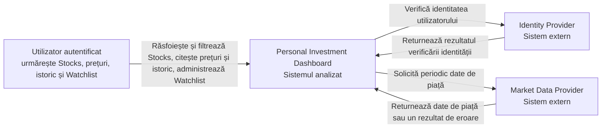
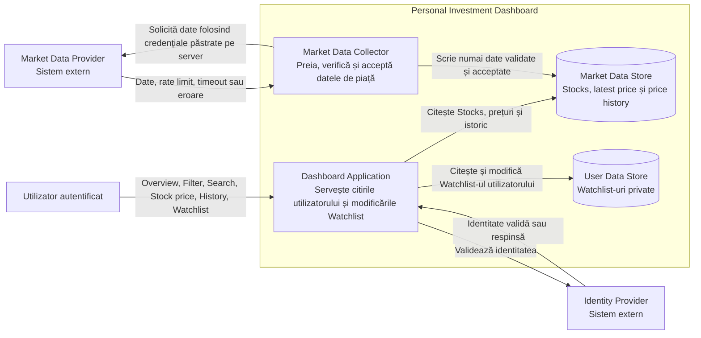
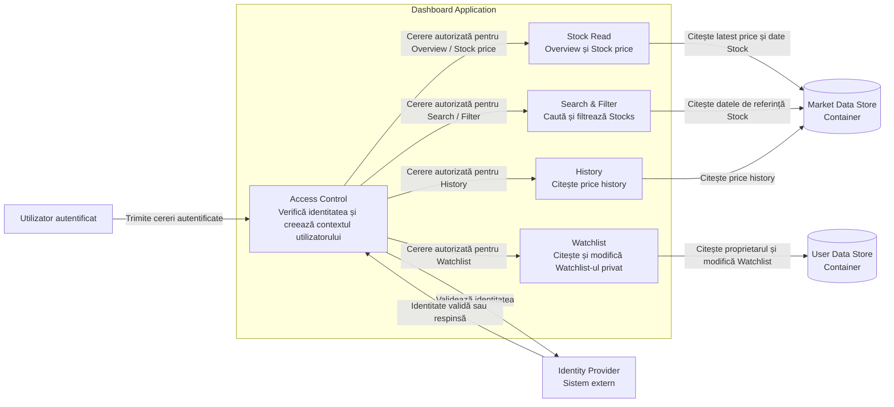
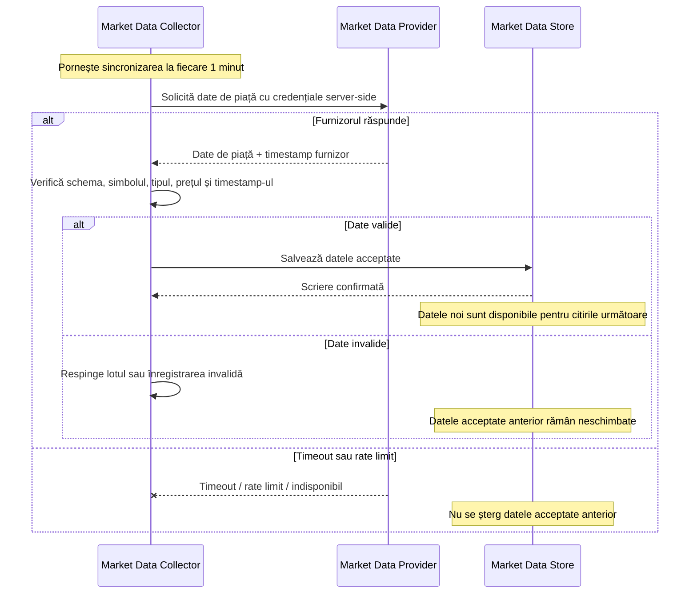
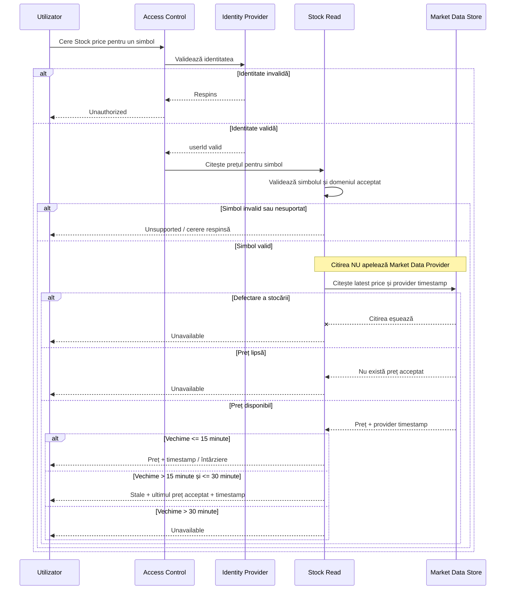
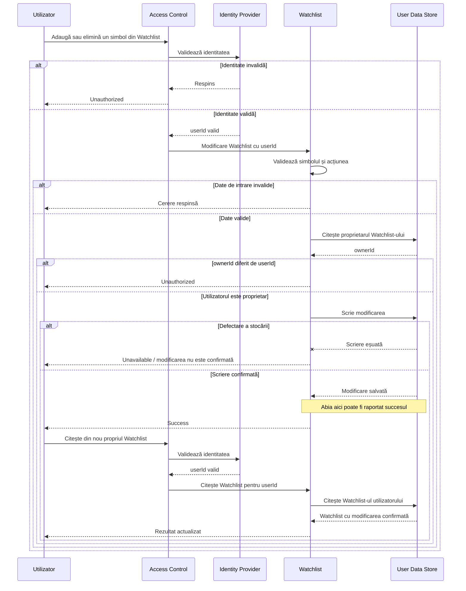

# Laboratorul 3: Desenează limita Dashboard-ului

## Personal Investment Dashboard

## Context

În Laboratorul 1 am definit produsul, iar în Laboratorul 2 am stabilit țintele de calitate și volumul de lucru. Pentru nivelul maxim analizat, Dashboard-ul trebuie să poată susține aproximativ **10.296 RPS la deschiderea pieței**, iar citirea `Stock price` este fluxul cel mai intens.

În acest laborator deschid limita sistemului și împart Dashboard-ul în câteva părți cu responsabilități clare. Am păstrat proiectarea intenționat simplă. Nu introduc containere sau componente care nu sunt necesare pentru funcțiile din primele două laboratoare.

Deciziile folosite în raport sunt:

- autentificarea este realizată printr-un **Identity Provider extern**;
- Market Data Provider rămâne generic;
- Market Data Collector sincronizează datele de piață la interval de **1 minut**;
- citirile utilizatorului folosesc datele deja sincronizate și **nu trimit o cerere nouă către Market Data Provider**;
- datele de piață și datele private ale utilizatorului sunt păstrate separat;
- un utilizator poate citi și modifica numai propriul Watchlist;
- după o modificare confirmată a Watchlist-ului, următoarea citire a aceluiași utilizator trebuie să vadă modificarea;
- dacă sincronizarea cu furnizorul eșuează, ultima valoare validă nu este ștearsă;
- pentru Stock price păstrez regula din Laboratorul 2: până la 15 minute datele sunt acceptate cu timestamp, între 15 și 30 minute sunt `Stale`, iar după 30 minute sunt `Unavailable`.

# 1. Diagrama System Context

La acest nivel nu arăt structura internă a Dashboard-ului. Se văd doar utilizatorul și sistemele externe cu care produsul interacționează direct.

**Rolurile din diagramă:**

- **Utilizator autentificat** – actorul uman direct.
- **Personal Investment Dashboard** – sistemul de interes.
- **Identity Provider** – confirmă identitatea utilizatorului.
- **Market Data Provider** – furnizează datele de piață folosite de Dashboard.

Market Data Provider poate răspunde cu date întârziate, date invalide, rate limit sau poate fi indisponibil. Dashboard-ul rămâne responsabil pentru modul în care aceste situații sunt prezentate utilizatorului.

# 2. Diagrama Container

În acest view deschid limita Dashboard-ului. Folosesc patru containere interne, suficiente pentru funcțiile și regulile definite până acum.

## Responsabilitățile containerelor

| Container | Responsabilitate |
|---|---|
| **Dashboard Application** | Primește cererile utilizatorului, verifică identitatea, validează input-ul și returnează Overview, Filter, Search, Stock price, History și Watchlist. |
| **Market Data Collector** | Sincronizează periodic datele de piață, validează răspunsurile furnizorului și salvează numai rezultate acceptate. |
| **Market Data Store** | Păstrează datele despre Stocks, ultimul preț acceptat și price history. |
| **User Data Store** | Păstrează Watchlist-urile private și legătura lor cu proprietarul. |

Separarea `Market Data Collector` de `Dashboard Application` este importantă deoarece citirile utilizatorilor nu trebuie să depindă de un apel nou la furnizor. La 30.000 de utilizatori, Laboratorul 2 a estimat 7.920 RPS în regim stabil și 10.296 RPS la deschiderea pieței. Acest trafic nu este tratat ca trafic direct către Market Data Provider.

Separarea `Market Data Store` de `User Data Store` păstrează distincte datele publice de piață de datele private ale utilizatorilor.

# 3. Diagrama Component

Această diagramă deschide **numai Dashboard Application**. Market Data Collector nu este descompus aici, deoarece cerința laboratorului spune să fie deschis doar Dashboard Application.

## Responsabilitățile componentelor

| Componentă | Responsabilitate |
|---|---|
| **Access Control** | Verifică identitatea prin Identity Provider și transmite mai departe identitatea utilizatorului validat. |
| **Stock Read** | Servește Overview și Stock price și aplică regulile `Stale` / `Unavailable`. |
| **Search & Filter** | Caută și filtrează instrumentele acceptate de V1. |
| **History** | Returnează istoricul de preț disponibil pentru un Stock. |
| **Watchlist** | Verifică proprietarul și citește sau modifică Watchlist-ul privat. |

Nu apar clase, metode sau funcții. Componentele reprezintă responsabilități interne ale aceluiași `Dashboard Application`.

# 4. Diagrame de secvență

## A. Sincronizarea datelor de piață

Market Data Collector pornește sincronizarea periodic. Credențialele pentru Market Data Provider rămân în partea de server și nu sunt trimise utilizatorului.

### Ipoteze pentru flux

- sincronizarea rulează la fiecare **1 minut**;
- Market Data Collector deține credențialele furnizorului pe server;
- datele sunt disponibile pentru utilizatori numai după confirmarea scrierii în Market Data Store;
- o sincronizare eșuată nu înlocuiește datele valide cu zero și nu le șterge;
- dacă datele anterioare îmbătrânesc, Dashboard Application aplică regula de actualitate din Laboratorul 2;
- un răspuns invalid al furnizorului nu devine automat rezultat valid în Dashboard.

## B. Citirea prețului unui Stock

Citirea unui preț folosește datele deja sincronizate. Nu există o cerere nouă către Market Data Provider pentru fiecare citire făcută de utilizator.

### Ipoteze pentru flux

- fiecare cerere de citire trece prin verificarea identității;
- simbolul este validat înainte de accesarea datelor;
- `Stock Read` citește exclusiv din Market Data Store;
- o citire normală a utilizatorului **nu generează o cerere nouă către Market Data Provider**;
- un preț lipsă nu este afișat ca `0`;
- până la 15 minute prețul este acceptat cu timestamp-ul furnizorului;
- între 15 și 30 minute este afișat ca `Stale`;
- după 30 minute rezultatul este `Unavailable`;
- o defectare a Market Data Store produce `Unavailable`, nu un preț inventat.

## C. Modificarea unui Watchlist privat

Succesul este raportat numai după ce modificarea a fost scrisă și confirmată în User Data Store.

### Ipoteze pentru flux

- Watchlist-ul are un proprietar identificat prin `userId`;
- verificarea proprietarului se face înainte de modificare;
- un utilizator nu poate citi sau modifica Watchlist-ul altui utilizator;
- succesul este returnat doar după confirmarea scrierii în User Data Store;
- dacă scrierea eșuează, Dashboard-ul nu afirmă că modificarea a fost făcută;
- după un `Success`, următoarea citire a aceluiași utilizator trebuie să includă modificarea confirmată;
- această regulă păstrează garanția `read-your-writes` definită în Laboratorul 2.

# 5. Verificarea proiectării față de Laboratorul 2

Arhitectura este legată direct de punctele de presiune observate în laboratorul anterior.

| Cerință sau risc | Decizie în această proiectare |
|---|---|
| Stock price generează cel mai mare trafic | `Stock Read` citește din Market Data Store și nu apelează furnizorul pentru fiecare cerere. |
| 10.296 RPS la deschiderea pieței | Traficul utilizatorilor este separat de sincronizarea furnizorului. Capacitatea reală trebuie verificată ulterior prin load testing. |
| Furnizorul poate fi lent sau indisponibil | `Market Data Collector` izolează sincronizarea de citirile utilizatorului. |
| Furnizorul poate trimite date invalide | Collector-ul validează înainte de salvare. |
| Prețurile pot deveni vechi | `Stock Read` clasifică rezultatul ca acceptat, `Stale` sau `Unavailable`. |
| Watchlist-ul este privat | `Access Control` validează identitatea, iar `Watchlist` verifică proprietarul. |
| Read-your-writes pentru Watchlist | Succesul este dat numai după scriere confirmată; următoarea citire vede modificarea. |

Estimarea de 10.296 RPS creează o cerință de capacitate, dar nu dovedește singură că această arhitectură poate susține volumul. Confirmarea se face prin măsurare și testare de încărcare.

# 6. Concluzie

Proiectarea folosește patru containere interne:

- Dashboard Application;
- Market Data Collector;
- Market Data Store;
- User Data Store.

Dashboard Application este împărțit în cinci responsabilități principale: Access Control, Stock Read, Search & Filter, History și Watchlist.

Fluxul de market data este separat de citirile utilizatorului. Dacă Market Data Provider are timeout, rate limit sau trimite date invalide, datele acceptate anterior rămân disponibile și sunt evaluate după regulile de actualitate. Astfel, o problemă a furnizorului nu este transformată automat într-un rezultat fals pentru utilizator.

Datele private sunt tratate separat. Watchlist-ul poate fi modificat doar de proprietar, iar succesul este raportat numai după confirmarea scrierii.

Această structură este suficientă pentru cerințele actuale și nu introduce încă tehnologii concrete, produse cloud sau detalii de implementare care nu sunt cerute de laborator.

## Surse de curs

- Laboratorul 3: **Desenează limita Dashboard-ului**.
- Lecția 3: **Cerințe de calitate, volum de lucru și capacitate**.
- Laboratorul 2: **Cuantifică citirile Dashboard-ului**.
- C4 Model: System Context, Container și Component views.
