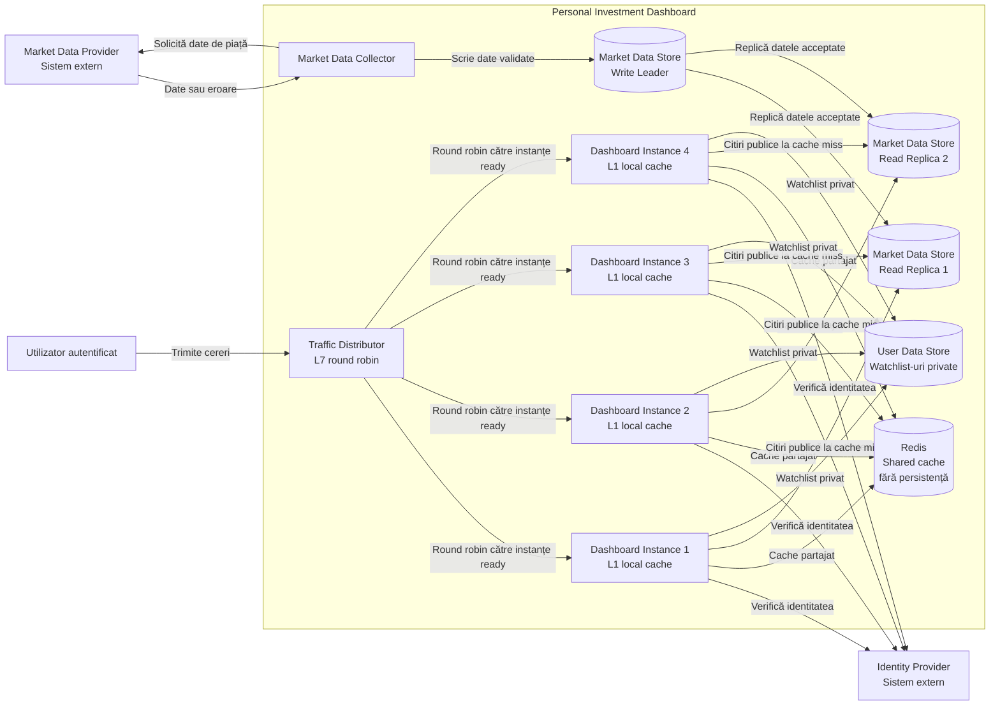
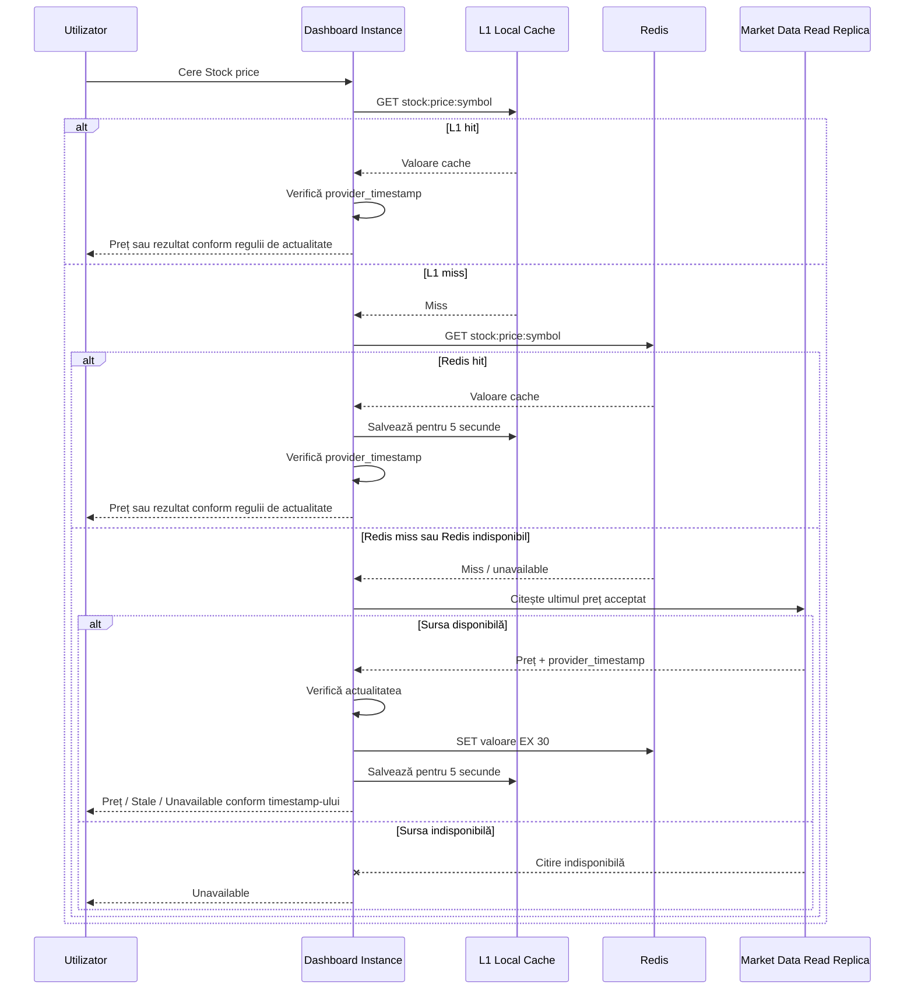
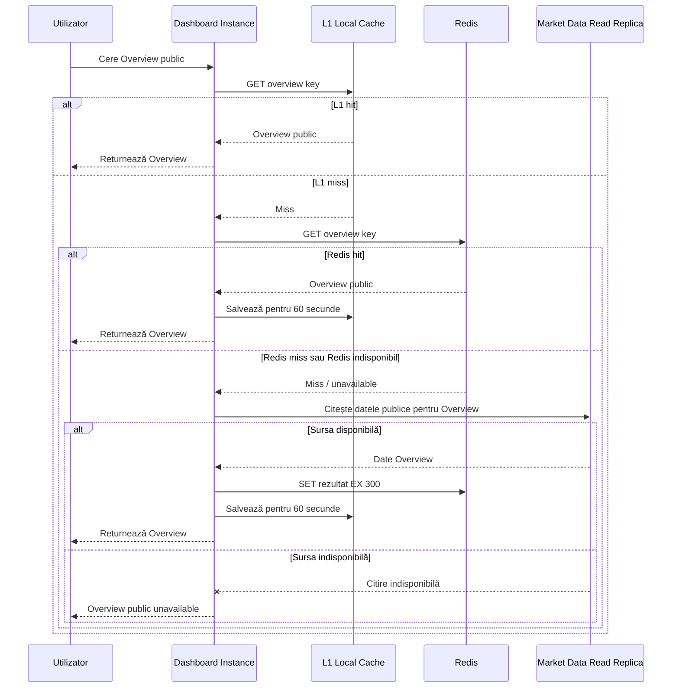
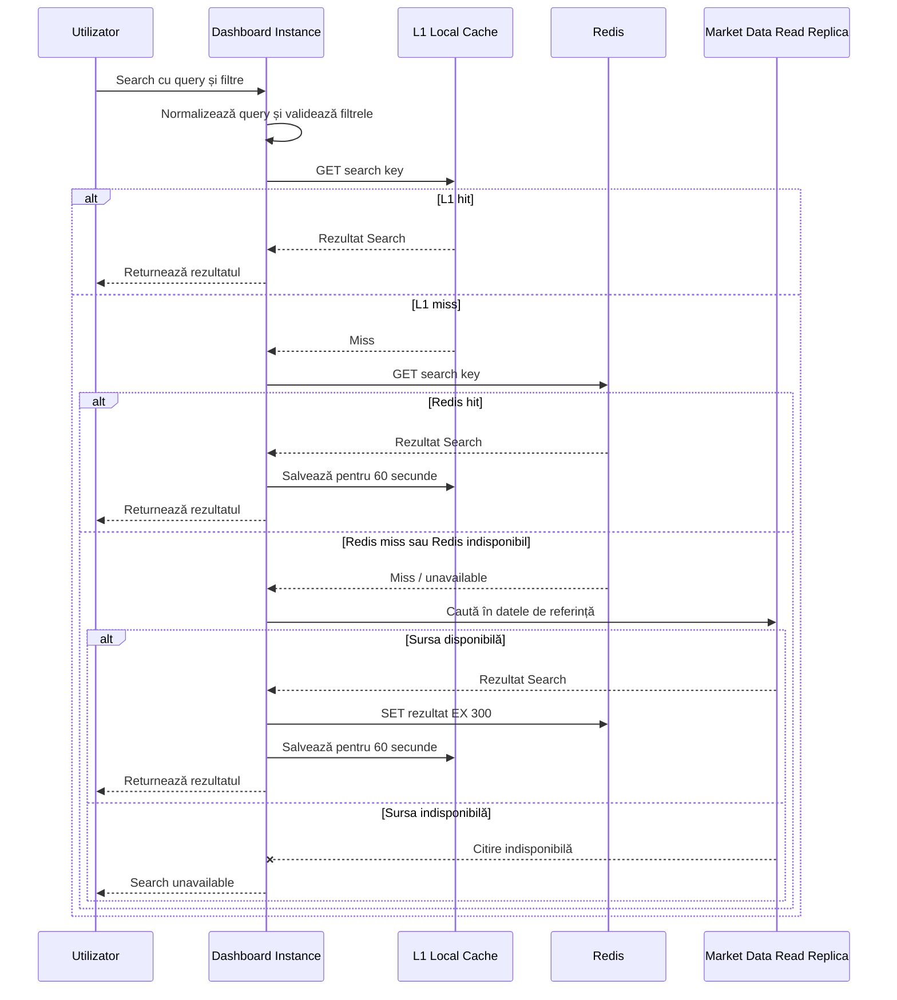

# Laboratorul 4: Scalează traseul de citire al Dashboard-ului

## Personal Investment Dashboard

## Context

În Laboratorul 3 am separat citirile utilizatorului de sincronizarea cu Market Data Provider. În acest laborator păstrez aceeași limită a sistemului și aceleași reguli de calitate, dar scalez traseul de citire pentru cazul cu 3.000 de utilizatori.

Nu schimb regulile de produs stabilite anterior:

- utilizatorul este autentificat printr-un Identity Provider extern;
- Market Data Provider rămâne extern și generic;
- citirile normale nu trimit o cerere nouă către furnizor;
- Market Data Store păstrează durabil prețurile acceptate și timestamp-urile furnizorului;
- un preț lipsă nu este zero;
- până la 15 minute prețul poate fi folosit cu timestamp-ul furnizorului;
- între 15 și 30 minute este `Stale`;
- după 30 minute este `Unavailable`;
- Watchlist-ul rămâne privat și nu este introdus în cache-ul partajat.

Modificările din acest laborator sunt interne: adaug distribuirea traficului, mai multe instanțe Dashboard, replici de citire pentru Market Data Store și două niveluri de cache.


# 1. Scalarea serviciului Dashboard

## 1.1 Ținta de capacitate

Pentru 3.000 de utilizatori, enunțul oferă:

**600 RPS pentru Stock price**

Marja cerută este de 20%.

Calcul:

```text
600 RPS × 1,20 = 720 RPS
```

Ținta pentru acest laborator este deci:

**720 RPS**

O instanță Dashboard poate procesa în siguranță **250 RPS** pentru Stock price.

Dacă nu am avea cerința de a continua după pierderea unei instanțe:

```text
720 / 250 = 2,88
```

Ar fi necesare minimum 3 instanțe.

Totuși, laboratorul cere ca ținta de 720 RPS să fie păstrată și după oprirea unei instanțe.

Cu 4 instanțe pregătite:

```text
4 × 250 = 1.000 RPS capacitate totală

după pierderea unei instanțe:

3 × 250 = 750 RPS
```

Rezultatul este:

```text
750 RPS >= 720 RPS
```

Prin urmare, aleg:

**4 instanțe Dashboard pregătite**

Aceasta este cea mai mică configurație care păstrează ținta după pierderea unei instanțe.


## 1.2 Distribuirea traficului

Aleg:

**L7 load balancing + round robin**

Motivul principal este că cererile Stock price au costuri de procesare apropiate, conform ipotezei laboratorului. Round robin distribuie simplu cererile între instanțele care sunt pregătite.

Nu folosesc IP hash deoarece nu am nevoie de sticky sessions. Starea importantă nu trebuie să rămână într-o anumită instanță Dashboard.

Avantaje:

- distribuție simplă și predictibilă;
- instanțele pot fi adăugate sau scoase fără schimbarea logicii aplicației;
- o instanță care nu mai este `ready` poate fi scoasă din distribuție;
- nu este necesară păstrarea utilizatorului pe aceeași instanță.

Limita principală:

Round robin presupune că instanțele disponibile au o capacitate apropiată. Dacă una dintre ele devine mai lentă fără să fie declarată indisponibilă, round robin poate continua să îi trimită aceeași proporție de trafic.

De aceea, health checks și măsurarea latenței rămân importante.


## 1.3 Ce se pierde și ce trebuie să se păstreze

O instanță Dashboard trebuie tratată ca fiind înlocuibilă.

Poate fi pierdut:

- cache-ul L1 din memoria locală;
- cereri aflate în procesare care nu au fost finalizate;
- valori temporare calculate doar pentru răspunsul curent.

Nu poate fi pierdut:

- prețurile acceptate și timestamp-urile furnizorului;
- price history;
- datele de referință pentru Stocks;
- Watchlist-urile utilizatorilor;
- progresul sincronizării datelor de piață;
- orice modificare confirmată utilizatorului.

Aceste date sunt păstrate în stocările durabile, nu doar în memoria unei instanțe Dashboard.

Redis este folosit numai ca cache. În proiectarea aleasă aici nu este sursa durabilă a datelor.


# 2. Scalarea Market Data Store

Enunțul oferă o capacitate de:

**400 RPS pentru o replică de citire**

Write leader-ul este rezervat pentru:

- scrierea datelor acceptate de Market Data Collector;
- citiri care chiar au nevoie de cea mai recentă valoare de pe leader.

Nu îl includ în capacitatea pentru citirile publice obișnuite.

Pentru ținta de 720 RPS:

```text
720 / 400 = 1,8
```

Rotunjesc în sus:

**2 read replicas**

Capacitatea lor teoretică totală este:

```text
2 × 400 = 800 RPS
```

Aceasta acoperă ținta de 720 RPS.

Configurația minimă folosită în laborator este:

- **1 write leader**
- **2 read replicas**

Observație: această configurație este minimul pentru capacitatea cerută. Dacă am avea și cerința ca 720 RPS să fie păstrați după pierderea unei read replica, ar fi necesare 3 read replicas. Enunțul cere explicit tolerarea pierderii unei instanțe Dashboard, nu și a unei replici de citire, deci nu adaug o a treia replică fără o cerință suplimentară.


# 3. Container View actualizat



Această diagramă extinde Container View din Laboratorul 3. Nu schimb actorii sau sistemele externe. Doar deschid mai mult traseul intern de citire.


# 4. Strategia de cache

Folosesc două niveluri:

- **L1** – memorie locală în fiecare instanță Dashboard;
- **L2** – Redis partajat între toate instanțele.

L1 este cel mai rapid, dar fiecare instanță are propriul conținut și îl poate pierde în orice moment.

Redis reduce numărul de citiri repetate către Market Data Store și permite reutilizarea aceluiași rezultat între mai multe instanțe Dashboard.

Redis nu este durabil în această proiectare. Dacă se restartează gol, datele sunt reconstruite din Market Data Store.

Nu folosesc hit rate-ul cache-ului la calculul numărului de instanțe Dashboard sau de read replicas. Dimensionarea de bază funcționează și cu cache gol.

Am ales trei citiri publice:

1. Stock price;
2. Overview public;
3. Search public.

Watchlist nu este introdus în cache-ul partajat deoarece conține date private ale utilizatorului.


# 5. Cache pentru Stock price

## 5.1 Contractul cache-ului

| Decizie | Alegere |
|---|---|
| Cheie | `stock:price:{symbol}` |
| Exemplu | `stock:price:AAPL` |
| Valoare | simbol, preț, `provider_timestamp`, `cached_at`, stare |
| Sursa durabilă | Market Data Store read replicas |
| L1 TTL | 5 secunde |
| Redis TTL | 30 secunde |
| Strategie | TTL simplu |
| Date private | Nu |
| La L1 miss | verifică Redis |
| La Redis miss | citește read replica și completează cache-ul |
| Redis indisponibil | continuă spre sursa durabilă |
| Sursa indisponibilă | `Unavailable` dacă nu există o valoare acceptabilă deja în cache |

Exemplu de valoare:

```json
{
  "symbol": "AAPL",
  "price": 231.42,
  "provider_timestamp": "2026-10-08T14:29:00-04:00",
  "cached_at": "2026-10-08T14:29:08-04:00",
  "state": "current"
}
```

`cached_at` nu înlocuiește `provider_timestamp`.

Un obiect poate intra acum în Redis chiar dacă prețul furnizorului are deja câteva minute vechime. De aceea, TTL-ul Redis arată doar cât timp mai rămâne cheia în cache, nu cât de actual este prețul de piață.


## 5.2 Secvența Stock price



Niciun cache hit nu elimină verificarea `provider_timestamp`.


# 6. Cache pentru Overview

Pentru Overview introduc în cache numai partea **publică** a rezultatului.

Nu pun într-o cheie comună:

- Watchlist-ul utilizatorului;
- informații private de portofoliu;
- rezultate dependente de identitatea utilizatorului.

Dacă Overview are și informație personală, aceasta este combinată separat după citirea rezultatului public din cache.

## 6.1 Contractul cache-ului

| Decizie | Alegere |
|---|---|
| Cheie | `overview:us:page:{page}:sort:{sort}` |
| Exemplu | `overview:us:page:1:sort:symbol` |
| Valoare | rezultat public al paginii Overview |
| Sursa durabilă | Market Data Store read replicas |
| L1 TTL | 60 secunde |
| Redis TTL | 300 secunde |
| Strategie | TTL simplu |
| Date private | Nu |
| La L1 miss | verifică Redis |
| La Redis miss | citește read replica și completează cache-ul |
| Redis indisponibil | continuă spre sursa durabilă |
| Sursa indisponibilă | `Unavailable` pentru partea publică dacă nu există un rezultat acceptabil în cache |

Exemplu:

```json
{
  "market": "US",
  "page": 1,
  "sort": "symbol",
  "items": [
    {"symbol": "AAPL", "price": 231.42},
    {"symbol": "MSFT", "price": 521.18}
  ],
  "source_timestamp": "2026-10-08T14:29:00-04:00",
  "cached_at": "2026-10-08T14:29:10-04:00"
}
```


## 6.2 Secvența Overview




# 7. Cache pentru Search

Search poate fi partajat între utilizatori numai dacă cheia include toate intrările care modifică rezultatul și rezultatul nu conține informații private.

Normalizez textul căutat înainte de formarea cheii.

## 7.1 Contractul cache-ului

| Decizie | Alegere |
|---|---|
| Cheie | `search:stocks:q:{query}:exchange:{exchange}:type:{type}` |
| Exemplu | `search:stocks:q:app:exchange:all:type:common_adr` |
| Valoare | listă publică de rezultate Stock |
| Sursa durabilă | datele de referință din Market Data Store |
| L1 TTL | 60 secunde |
| Redis TTL | 300 secunde |
| Strategie | TTL simplu |
| Date private | Nu |
| La L1 miss | verifică Redis |
| La Redis miss | citește sursa durabilă și completează cache-ul |
| Redis indisponibil | continuă spre sursa durabilă |
| Sursa indisponibilă | `Unavailable` dacă rezultatul nu poate fi reconstruit |

Exemplu:

```json
{
  "query": "app",
  "exchange": "all",
  "type": "common_adr",
  "results": [
    {"symbol": "AAPL", "name": "Apple Inc.", "exchange": "NASDAQ"}
  ],
  "source_version": "2026-10-08T14:20:00-04:00",
  "cached_at": "2026-10-08T14:29:12-04:00"
}
```


## 7.2 Secvența Search




# 8. Încărcarea în avans a cache-ului

Cache warming-ul trebuie să fie limitat. Nu încerc să încarc toate instrumentele și toate căutările.

Înainte de deschiderea pieței preîncarc:

- Stock price pentru **top 150 Stocks** după frecvența citirilor recente;
- cheia implicită pentru Overview public;
- maximum **20 de chei Search** folosite cel mai frecvent în perioada recentă.

Prin urmare, warming-ul rămâne un set mic și controlat.

Pentru un sistem care încă nu are istoric de utilizare, nu inventez artificial cele mai populare căutări. În acest caz preîncărcarea poate porni doar cu cele 150 de simboluri selectate operațional și Overview-ul implicit.

Warming-ul nu este condiție pentru pornirea serviciului.

Dacă Redis este gol după restart:

1. L1 va fi inițial gol;
2. Redis va fi inițial gol;
3. cererile pot folosi Market Data Store;
4. răspunsurile reconstruiesc treptat cache-ul.

Dacă warming-ul nu s-a terminat până la deschiderea pieței, utilizatorul poate primi în continuare rezultate prin fallback la read replicas.

Nu permit însă ca fallback-ul să suprasolicite sursa durabilă.

Pentru Stock price, cele două read replicas au împreună 800 RPS capacitate declarată, iar ținta laboratorului este 720 RPS. Cererile sunt acceptate numai în limita capacității sigure.

Dacă această capacitate este epuizată:

**Dashboard returnează `Unavailable` în loc să trimită trafic nelimitat către Market Data Store.**

Pentru Overview și Search nu există în enunț o capacitate separată măsurată. Din acest motiv nu presupun că cei 80 RPS rămași sunt automat disponibili pentru orice alt tip de interogare. Aceste căi trebuie testate separat.


# 9. Redis și persistența

Aleg:

**Redis fără persistență pe disc**

Nu folosesc RDB și nu folosesc AOF.

Motivul este că Redis este doar un strat de cache. Sursa de adevăr rămâne Market Data Store.

După restart:

- Redis poate fi complet gol;
- Dashboard continuă cu L1 și cu sursa durabilă;
- cache-ul se reconstruiește prin citiri și warming controlat.

Această alegere simplifică recuperarea și evită tratarea Redis ca stocare durabilă.


# 10. Comenzi Redis pentru Stock price

Conexiunea se verifică mai întâi:

```text
$ redis-cli PING
PONG
```

Prima citire arată că cheia lipsește:

```text
$ redis-cli GET stock:price:AAPL
(nil)
```

După citirea din Market Data Store, rezultatul este introdus în Redis:

```text
$ redis-cli SET stock:price:AAPL '{"symbol":"AAPL","price":231.42,"provider_timestamp":"2026-10-08T14:29:00-04:00","cached_at":"2026-10-08T14:29:08-04:00","state":"current"}' EX 30
OK
```

A doua citire este cache hit:

```text
$ redis-cli GET stock:price:AAPL
"{\"symbol\":\"AAPL\",\"price\":231.42,\"provider_timestamp\":\"2026-10-08T14:29:00-04:00\",\"cached_at\":\"2026-10-08T14:29:08-04:00\",\"state\":\"current\"}"
```

Verificarea TTL:

```text
$ redis-cli TTL stock:price:AAPL
29
```

Valoarea exactă a TTL poate fi 30, 29 sau puțin mai mică, în funcție de timpul dintre comenzi.

Important: `TTL 29` nu înseamnă că prețul are 1 secundă vechime. Actualitatea se calculează folosind `provider_timestamp`.


# 11. Comenzi Redis pentru Overview

Prima citire:

```text
$ redis-cli GET overview:us:page:1:sort:symbol
(nil)
```

Completarea după citirea sursei:

```text
$ redis-cli SET overview:us:page:1:sort:symbol '{"market":"US","page":1,"sort":"symbol","items":[{"symbol":"AAPL","price":231.42},{"symbol":"MSFT","price":521.18}],"source_timestamp":"2026-10-08T14:29:00-04:00","cached_at":"2026-10-08T14:29:10-04:00"}' EX 300
OK
```

Verificarea valorii:

```text
$ redis-cli GET overview:us:page:1:sort:symbol
"{\"market\":\"US\",\"page\":1,\"sort\":\"symbol\",\"items\":[{\"symbol\":\"AAPL\",\"price\":231.42},{\"symbol\":\"MSFT\",\"price\":521.18}],\"source_timestamp\":\"2026-10-08T14:29:00-04:00\",\"cached_at\":\"2026-10-08T14:29:10-04:00\"}"
```

Verificarea TTL:

```text
$ redis-cli TTL overview:us:page:1:sort:symbol
298
```


# 12. Comenzi Redis pentru Search

Prima citire:

```text
$ redis-cli GET search:stocks:q:app:exchange:all:type:common_adr
(nil)
```

Completarea cache-ului:

```text
$ redis-cli SET search:stocks:q:app:exchange:all:type:common_adr '{"query":"app","exchange":"all","type":"common_adr","results":[{"symbol":"AAPL","name":"Apple Inc.","exchange":"NASDAQ"}],"source_version":"2026-10-08T14:20:00-04:00","cached_at":"2026-10-08T14:29:12-04:00"}' EX 300
OK
```

Cache hit:

```text
$ redis-cli GET search:stocks:q:app:exchange:all:type:common_adr
"{\"query\":\"app\",\"exchange\":\"all\",\"type\":\"common_adr\",\"results\":[{\"symbol\":\"AAPL\",\"name\":\"Apple Inc.\",\"exchange\":\"NASDAQ\"}],\"source_version\":\"2026-10-08T14:20:00-04:00\",\"cached_at\":\"2026-10-08T14:29:12-04:00\"}"
```

Verificarea TTL:

```text
$ redis-cli TTL search:stocks:q:app:exchange:all:type:common_adr
297
```

Aceste comenzi folosesc valori concrete. La rularea locală, numărul returnat de `TTL` diferă în funcție de timpul trecut între comenzi.


# 13. Ce se întâmplă la defectare

## Pierderea unei instanțe Dashboard

Traffic Distributor încetează să trimită trafic către instanța care nu mai este `ready`.

Rămân 3 instanțe:

```text
3 × 250 = 750 RPS
```

Ținta de 720 RPS continuă să fie acoperită.

Cache-ul L1 al instanței pierdute dispare, dar acest lucru este acceptabil.

---

## Redis indisponibil

Redis este tratat ca strat opțional de accelerare.

Fluxul devine:

```text
L1 miss
-> Redis unavailable
-> Market Data Read Replica
```

Nu declar că întregul Dashboard este indisponibil doar pentru că Redis nu funcționează.


## Redis pornește gol

Nu există pierdere de date durabile.

Cheile sunt reconstruite din Market Data Store.

Warming-ul pentru top 150 Stocks și cheile limitate de Overview/Search reduce presiunea inițială, dar sistemul nu depinde de succesul complet al warming-ului.


## Read replica indisponibilă

Load-ul de citire trebuie direcționat numai către replicile disponibile.

Configurația minimă cu două read replicas nu poate garanta 720 RPS după pierderea uneia:

```text
1 × 400 = 400 RPS
```

Prin urmare, această situație reduce capacitatea disponibilă.

Laboratorul nu cere păstrarea țintei după pierderea unei read replica. Dacă aceasta ar deveni cerință, ar trebui adăugată cel puțin încă o replică sau demonstrată altă capacitate prin măsurare.


## Market Data Provider indisponibil

Citirile utilizatorilor nu îl apelează direct.

Market Data Collector poate eșua la sincronizare, iar datele deja acceptate rămân în Market Data Store.

Dashboard aplică în continuare regula:

- până la 15 minute: rezultat acceptat cu timestamp;
- 15–30 minute: `Stale`;
- peste 30 minute: `Unavailable`.

Cache-ul nu modifică această regulă.


# 14. Rezumatul capacității

| Element | Valoare |
|---|---:|
| Stock price workload | 600 RPS |
| Marjă | 20% |
| Țintă | 720 RPS |
| Capacitate Dashboard / instanță | 250 RPS |
| Instanțe necesare fără tolerarea unei pierderi | 3 |
| Instanțe pregătite alese | **4** |
| Capacitate după pierderea unei instanțe | **750 RPS** |
| Capacitate read replica | 400 RPS |
| Read replicas minime | **2** |
| Capacitate totală read replicas | **800 RPS** |
| Redis persistence | **Fără persistență** |
| Stock price L1 / Redis TTL | **5 s / 30 s** |
| Overview L1 / Redis TTL | **60 s / 300 s** |
| Search L1 / Redis TTL | **60 s / 300 s** |
| Prewarm Stock price | **Top 150 Stocks** |
| Prewarm Search | **maximum 20 chei frecvente** |


# 15. Concluzie

Pentru cazul de 3.000 de utilizatori, ținta pentru Stock price este de 720 RPS după aplicarea marjei de 20%.

Am ales 4 instanțe Dashboard. După pierderea uneia rămân 750 RPS de capacitate măsurată, deci ținta este păstrată.

Traficul este distribuit la L7 prin round robin. Instanțele nu păstrează stare durabilă local, deci o cerere nu trebuie să rămână legată de aceeași instanță.

Market Data Store folosește un write leader și două read replicas. Replicile oferă împreună 800 RPS pentru citirile publice obișnuite.

Pentru reducerea citirilor repetate am introdus L1 local cache și Redis pentru Stock price, partea publică a Overview și Search. Watchlist-ul și alte rezultate private nu sunt puse în cache-ul partajat.

Redis este fără persistență. Poate fi pierdut complet și reconstruit din Market Data Store. Din acest motiv, capacitatea de bază nu presupune niciun cache hit.

Înainte de deschiderea pieței se face warming limitat pentru top 150 Stocks, Overview-ul implicit și maximum 20 de chei Search frecvente. Dacă warming-ul este incomplet sau Redis este gol, sistemul folosește sursa durabilă în limita capacității sigure. După atingerea limitei, este preferat un rezultat `Unavailable` în locul supraîncărcării sursei.


## Surse de curs

- Laboratorul 4: **Scalează traseul de citire al Dashboard-ului**.
- Lecția 4: **Descompunerea arhitecturii și fluxurile de date**.
- Laboratorul 3: **Desenează limita Dashboard-ului**.
- Laboratorul 2: **Cuantifică citirile Dashboard-ului**.
